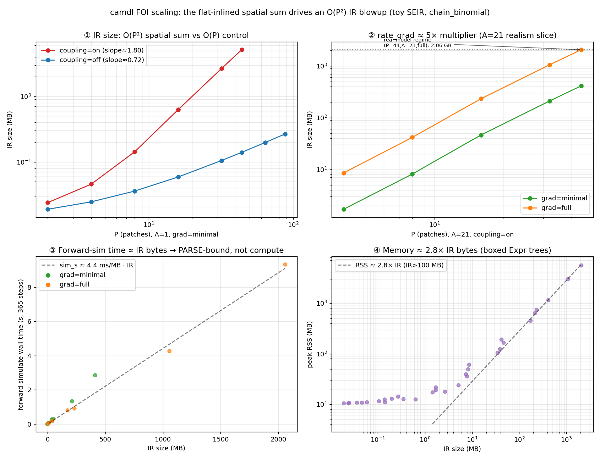

# FOI scaling bench: the flat-inlined spatial sum is an O(P²) IR blowup

Date: 2026-05-29
Project: camdl
Tags: performance, force-of-infection, scaling, ir, chain-binomial, benchmarks

## Context / question

The `kano_lga_seirv` measles model (44 Kano LGAs × 21 age groups, SEIRV) in
`playpen-camdl-measles/projects/nga/getting-started-simple` is slow and
memory-heavy enough to be painful for the fit workflow it exists to teach. The
goal here is not to fix it yet, but to **characterize the scaling** across model
size with a controlled toy, isolate the root cause(s), and produce a
prioritized, reproduction-backed fix list aimed at ~10×. A prior `profile-review.md`
flagged "fully expanded spatial models" qualitatively; this note replaces that
with measurements.

## Method

Three reproducible artifacts (all committed under `scripts/` + `make` targets):

- **Toy generator** `scripts/gen_scaling_models.py` — emits a stripped spatial
  age-structured SEIR `.camdl` parametrized by `P` (patches), `A` (ages),
  `coupling ∈ {on,off}`, `grad ∈ {minimal,full}`. It faithfully reproduces the
  Kano FOI *shape*: the per-patch aggregates `N[l]`, `I_agg[l]` and the spatial
  coupling **sum inside the infection rate**:
  `kappa * sum(q in patch, W[l,q]*I_agg[q]/N[q])`.
  `coupling=off` drops the spatial term (control); `grad=minimal` bakes the FOI
  constants as literals so no parameter is free → no `rate_grad` (control).
  All compiles use `--no-dim-check` (synthetic model; dimcheck does not change
  the emitted `rate`/`rate_grad` trees).
- **Macro sweep** `scripts/bench_scaling.py` (`make bench-scaling`) — full
  `camdl compile` → `camdl simulate` pipeline under `/usr/bin/time -l`, recording
  `ir_bytes, compile_s, sim_s, peak_rss_mb` per scale point →
  `docs/dev/notes/assets/scaling/scaling.tsv` + `scaling_curves.png`.
- **Micro bench** `rust/crates/sim/benches/scaling.rs` (`make bench-micro`) —
  criterion benches for `eval_propensities`, `step_one`, and load
  (`ir::from_str` + `CompiledModel::new`) across a P×A grid, isolating *per-step*
  compute from the parse cost.

A matched `camdlc`/`camdl` pair built from HEAD (`make build`) is required; the
runtime finds the compiler via `CAMDLC=<abs path to camdlc.exe>`.



## Baseline (the real model, reproduced)

`camdl simulate kano_lga_seirv.camdl --backend chain_binomial --scenario baseline`
(4,620 compartments, 11,836 transitions, 4,388 daily steps):

| metric | value |
| --- | --- |
| wall time | ~45 s (38.5 s user) |
| peak RSS | 8.2 GB |
| compiled IR JSON | 2.6 GB |
| one `infection` transition object | 2.94 MB = 587 KB `rate` + 2.35 MB `rate_grad` |
| ×924 infection transitions | ≈ the whole 2.6 GB |
| time split | ~16.5 s camdlc compile + ~26.6 s rust (parse + sim) |

Verified by streaming the compiled IR (`/tmp/kano.ir.json`):

```
transition counts by kind: infection=924, progression=924, recovery=924,
                           aging=4400, death=4620, births=44
first infection transition object bytes: 2,939,947
  (rate at offset 156; rate_grad at offset 587,399)
```

## Root cause (verified)

The FOI `let N[l]`, `let I_agg[l]` and the spatial `sum(q in patch, …)` are
**flat-inlined into every `(patch,age)` infection rate tree, and again into each
free parameter's gradient tree**. `N[q]` is a 105-element `PopSum` (5 comps ×
21 ages) re-expanded `P=44`× inside each of `P·A=924` infection transitions,
then ×~5 again for the gradients. There is no cross-transition
common-subexpression elimination at eval time either — `eval_resolved`
(`rust/crates/sim/src/resolved_expr.rs`) walks each tree fresh, recomputing
`N[q]`/`I_agg[q]` for every `(l,a)`. So the representation is
**O(P²·A²) in IR size** and a step is **O(P²·A)** in eval, where it should be
O(P·A) size and O(P·A + P²) eval.

Additionally, `sum(...)` is lowered to a left-nested `BinOp::Add` chain rather
than a single reduction node, which (a) makes the trees deep and (b) trips a
hard parse limit (below).

## Scaling results

### H1 — IR size: O(P²) coupling-on vs O(P) off (slope slice, A=1, grad=minimal)

| P | IR bytes (on) | IR bytes (off) |
| --- | --- | --- |
| 8  | 142,779   | 35,949 |
| 16 | 627,538   | 59,004 |
| 32 | 2,674,220 | 105,348 |
| 44 | 5,148,038 | 140,100 |
| 64 | — (parse cliff) | 198,024 |

`on` grows quadratically (32→44 = 1.93× for a 1.375× P, i.e. exponent ≈ 2.0);
`off` grows linearly (~3 KB/patch). The single `kappa*sum(q…)` term is the
entire difference.

### H2 — forward-sim wall time is PARSE-bound, not compute-bound

The cleanest proof is the realism slice at `P=44, A=21`: `grad=minimal` and
`grad=full` simulate **identical dynamics** (forward `simulate` never evaluates
`rate_grad`), yet:

| variant | IR | compile_s | sim_s | RSS |
| --- | --- | --- | --- | --- |
| P44 A21 minimal | 412 MB | 3.43 | **2.85** | 1.16 GB |
| P44 A21 full    | 2060 MB | 11.79 | **9.32** | 5.64 GB |

The 6.5 s sim-time delta is *entirely* parsing the 5× larger `rate_grad` trees
that forward simulation never reads. Across all points `sim_s ≈ 4.4 ms/MB · IR`.

### H4 — peak RSS ≈ 2.7× IR bytes

The boxed in-memory `Expr`/`ResolvedExpr` tree is ~2.7× the JSON byte size
(P44A21full: 5639/2060 = 2.7×; P32A21full: 2995/1056 = 2.8×). Memory and IR
size are the same lever.

### The gradient multiplier ≈ 5.0× (grad slice, A=7, coupling=on)

minimal→full IR ratio is a flat ~5.0× (P4: 4.8×, P8: 5.2×, P16: 5.0×, P32: 5.0×)
— the FOI depends on ~5 free params (R0, gamma, kappa, amplitude, iota), each
contributing one gradient tree as large as the rate tree. This 5× is **pure
overhead for forward simulation** and only pays off in gradient-based inference
(PGAS/NUTS).

## New finding: a hard parse cliff at P ≈ 50 (coupling-on)

At `P=64, A=1` the model compiles but **fails to load**:

```
$ camdl simulate P64_A1_on_minimal.ir.json --backend chain_binomial
error: IR load error: IR JSON parse error: recursion limit exceeded at line 498 column 79
```

The flat-inlined spatial sum nests a `P`-deep `BinOp::Add` chain; each operator
is two serde container levels, so ~`2P` levels hit serde_json's default
recursion limit (128) at `P ≈ 64`. The real Kano model parses only because its
spatial sum is `P=44 < 64`. **Past ~50 patches the IR is literally unparseable**
— the 774-patch Nigeria target from `profile-review.md` is impossible in this
representation, independent of time/memory. This is a correctness-class symptom,
not merely a performance one.

## Per-step micro-bench (H3 — confirmed)

The parse-bound macro `sim_s` can't show per-step compute scaling; the criterion
benches (`make bench-micro`) isolate it. `eval_propensities` per call (ns), A=1:

| P | coupling=on | coupling=off | on/off |
| --- | --- | --- | --- |
| 4  | 365    | 157  | 2.3× |
| 8  | 1,145  | 317  | 3.6× |
| 16 | 4,090  | 645  | 6.3× |
| 32 | 18,863 | 1,299 | 14.5× |

Coupling-on doubles → ~4× (O(P²)); coupling-off doubles → ~2× (O(P)). At P=32
the spatial sum already makes a step **14.5× slower**, and the gap widens with P.
At A=7 the same pattern holds (on: P8=15.6 µs → P32=179 µs ≈ ×4 per doubling;
off: 2.46 → 11.0 µs ≈ ×2). `step_one` (full draw + bookkeeping) tracks
`eval_propensities` for coupling-on (eval dominates the step): A=1 on
760 ns → 21.6 µs across P4→P32; off 683 ns → 4.0 µs.

`load_parse_compile` (`ir::from_str` + `CompiledModel::new`) holds a steady
**~230 MiB/s regardless of P/A** — parse+compile is linear in IR *bytes* at a
fixed rate (the 2.06 GB anchor ≈ 9 s, matching the macro `sim_s`). So the two
costs compose as: forward-sim wall ≈ (IR bytes / 230 MiB/s) + N_steps × per-step,
and at Kano scale the first term dominates — confirming H2 from the compute side.

## Flamegraph attribution (verified — and a new cheap fix falls out)

Profiled the anchor `simulate` (P=44,A=21,on,full) with macOS `/usr/bin/sample`
(symbolicated, no sudo) → static SVG via inferno
([`assets/scaling/flamegraph_real.svg`](assets/scaling/flamegraph_real.svg),
`make flamegraph-real`); samply gives an interactive view. The `sample` run:
7,481 main-thread samples over ~9.9 s.

**Inclusive phase split:** `ir::from_str` = 4,843 / 7,481 ≈ **65%** of the
forward-sim wall. The remaining ~35% is `CompiledModel::new` (resolve into
`ResolvedExpr`) + `run_chain_binomial` stepping + output; the actual stepping
hot fn `sim::resolved_expr::eval_resolved` is only **879 (~12%)**.

**Self-time (leaf) top of stack — the parse is dominated by serde:**

| self samples | % | symbol |
| --- | --- | --- |
| 1,286 | 17% | `serde::private::de::content::content_clone` |
| 879 | 12% | `sim::resolved_expr::eval_resolved` (← actual stepping) |
| 861 | 12% | `drop_in_place<serde…content::Content>` |
| 710 | 9% | `_xzm_free` (malloc) |
| 568 | 8% | serde `SeqAccess::next_element_seed` |
| ~400 | 5% | `_xzm_xzone_malloc` + memmove |

So **~50%+ of the simulate is serde *content-buffering*** — cloning each IR node
into an owned `Content` value and dropping it — not parsing per se. Root cause,
verified in code: `ir::expr::Expr` is `#[serde(untagged)]` (`rust/crates/ir/src/expr.rs:179`):

```
#[derive(Debug, Clone, PartialEq, Serialize, Deserialize)]
#[serde(untagged)]
pub enum Expr { Const(ConstExpr), Param(ParamExpr), Pop(PopExpr), … }
```

`untagged` makes serde buffer every node into a heap-allocated `Content`, then
trial-deserialize each variant from the buffer (clone + drop on backtrack). For
a multi-million-node recursive tree this is pathological — and it is *orthogonal*
to the FOI blowup: it taxes **every** model's load time, spatial or not.

## Prioritized fix list (candidates — to be designed behind a proposal)

Ordered by leverage ÷ risk. **E** is the cheapest broad win (do first); **B** is
the real 10× for the spatial/fit workload (proposal-gated).

1. **E — drop `#[serde(untagged)]` on `Expr` (LANDED, branch `perf/ir-expr-deser`).**
   The profile showed ~50%+ of `simulate` is serde `Content` clone/drop/malloc
   from the untagged-enum path (above). Each `Expr` node is already a single-key
   object whose key names the variant, so the fix is a hand-written `Deserialize`
   (`rust/crates/ir/src/expr.rs`) that reads that one key and dispatches in a
   single streaming pass — no buffering. `Serialize` is unchanged (`untagged`
   kept), so the emitted JSON is byte-identical; the `golden_deser` round-trip
   suite is the equivalence proof, plus new `Expr` round-trip / malformed-rejection
   unit tests. _Risk: low (deserialization path only)._

   **Measured (criterion, `make bench-micro`; before = derived untagged):**

   | model | load before | load after | speedup |
   | --- | --- | --- | --- |
   | P16_A1_on | 2.44 ms | 0.64 ms | 3.4× |
   | P32_A1_on | 12.1 ms | 2.09 ms | 5.8× |
   | P16_A7_on | 25.8 ms | 9.11 ms | 2.8× |
   | P32_A7_on (34 MB IR) | 128 ms | 35.8 ms | 3.6× |

   The win **grows with tree size** (untagged buffering scales with depth), all
   `p < 0.05` — see [`assets/scaling/deser_load_before_after.png`](assets/scaling/deser_load_before_after.png).
   End-to-end on the ~2 GB anchor (`P44_A21_on_full`),
   `simulate`-from-IR: **9.32 s → ~4.7 s (~2.0×)** — parse was ~65% of the run and
   drops ~3.5×, leaving stepping + resolve as the new floor (which is where B
   comes in). This is per-process load cost paid by *every* model and *every*
   run, spatial or not.

2. **B — CSE / per-coordinate let-binding execution (the real 10× fix).**
   Compute `N[l]`, `I_agg[l]` once per step (O(P·A·C)), the spatial force
   `F[l] = sum_q W[l,q]·I_agg[q]/N[q]` once per step (O(P²)), into scratch slots;
   each infection rate then reads `beta·seas·S[l,a]·((I_agg[l]+iota)/N[l] +
   kappa·F[l])` — O(1) per transition. Shrinks IR from O(P²·A²) → O(P·A), cuts a
   step from O(P²·A) → O(P·A + P²), shrinks `rate_grad` proportionally, **and
   removes the parse cliff** (no deep nesting). Requires an IR + evaluator change
   (a "load shared binding slot" node + a per-step preamble in evaluation order)
   and a compiler change to emit the bindings. _Risk: high (touches IR schema +
   eval + compiler); design behind a proposal._ Expected: order-of-magnitude on
   IR/compile/parse/RSS at Kano scale, and the dominant eval win.

2. **A — don't carry `rate_grad` on the forward-sim path (quick, simulate-only).**
   `rate_grad` is ~80% of the IR (the 5× multiplier) and is never read by
   `simulate`. Either let camdlc emit a grad-free IR for forward runs, or have
   the loader skip `rate_grad` when the consumer is forward simulation. ~5× on
   IR/compile/parse/RSS for `simulate`; **no help for inference** (PGAS needs the
   gradients). _Risk: low._ Good stopgap; subsumed by B for the fit path.

3. **D — lower `sum(...)` to a first-class reduction node, not an Add-chain.**
   A `Reduce`/weighted-`PopSum` node over an index set removes the deep nesting
   (kills the parse cliff on its own) and shrinks the tree. Complementary to B,
   smaller in scope. _Risk: medium (IR schema + eval + compiler, but local)._

4. **C — raise/replace the serde recursion limit.** A band-aid that lets deep
   trees parse but does nothing for size/memory/time. Only worth it if B/D are
   deferred. _Risk: low; not recommended as a standalone fix._

## Appendix

- **Stale bench:** `rust/crates/sim/benches/inference.rs` no longer compiles —
  it calls `step_one` (now 9 args, was 8: `fire_steps`), `eval_propensities`
  (now 7, was 6: `dt`, gh#54), and `bootstrap_filter` (now trait-based
  `ProcessModel`/`ObservationModel`/`SMCConfig`) with old signatures.
  `cargo bench -p sim --no-run --bench inference` → 7 errors. `cargo bench`
  (unfiltered) fails because of it; `make bench-micro` uses `--bench scaling`.
  The step_one/eval_propensities/negbin benches are mechanical arity fixes; the
  pfilter bench needs a real port to the new PF API. Recommend deleting the
  pfilter bench and folding the rest into `scaling.rs`, or repairing as a
  separate cleanup.

- **Reproduce:**
  ```
  make build
  make bench-scaling     # macro sweep + figure
  make bench-micro       # per-step criterion benches
  make flamegraph-real   # samply profile of the anchor simulate
  ```
