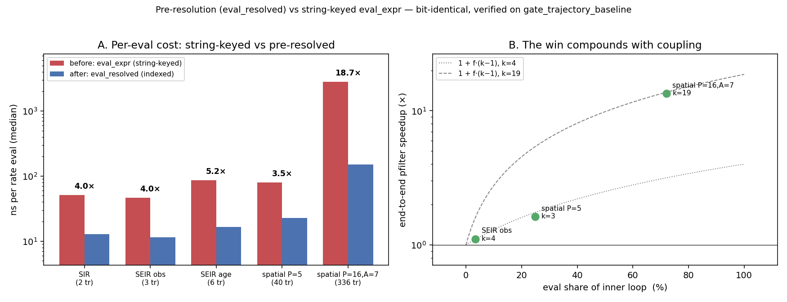

# Pre-resolution in the particle-filter inner loop: what it bought

Date: 2026-06-01 Project: camdl Tags: inference, particle-filter, eval,
propensity, profiling, pre-resolution, scaling

## Context / question

The brief: profile the particle-filter (PF) inner loop and prototype
"pre-resolution" — flatten the rate AST so `Pop`/`Param`/`TableLookup` leaves
carry resolved indices instead of string-keyed map lookups — then measure how
much it cuts inference run time, with bit-exactness preserved.

**Pre-resolution already shipped.** It is the production hot path, not a
prototype to build:

```
$ git log --oneline -- rust/crates/sim/src/resolved_expr.rs | tail -3
38e089d perf(sim): migrate all inference code to pre-resolved expressions
dacd55f feat(sim): add ResolvedModel to CompiledModel, resolve all Expr at construction
edb91d8 feat(sim): add ResolvedExpr — pre-resolved expression trees for hot-path eval
$ git show main:rust/crates/sim/src/gillespie.rs | grep -n eval_resolved
53:    eval_resolved(&ctx.model.resolved.rates[tr_idx], ctx).max(0.0)
```

So this note answers a sharper, still-open question: **how much did
pre-resolution buy, on which model classes, and is it bit-identical?** The two
evaluators both still exist in the tree — `eval_expr` (string-keyed, the
"before") and `eval_resolved` (indexed, the "after") — so the A/B is a direct,
non-invasive measurement, not a reconstruction.

## What the two paths actually do

`eval_expr` (`propensity.rs`) resolves every leaf by name on each call:

```
Expr::Param(p) => { let idx = ctx.model.param_index.get(p.param.as_str())…   // HashMap probe
Expr::Pop(p)   => { let global = ctx.model.comp_index.get(p.pop.as_str())…   // HashMap probe
Expr::TableLookup(w) => { … table_index.get(w.table_lookup.table…)           // HashMap probe
Expr::BindingRef(w)  => { ctx.model.model.bindings.iter().find(|b| b.name…)  // LINEAR SCAN
```

`param_index`, `comp_index`, `table_index`, `time_func_index` are all
`HashMap<String, usize>`. `eval_resolved` (`resolved_expr.rs`) replaces each
probe with `usize` array indexing and each `BindingRef` with an O(1) slot,
resolved once at `CompiledModel::new()`. Both walk the _same_ tree in the _same
order_ — the only difference is leaf access.

## Method

A `CAMDL_EVAL_UNRESOLVED` switch (`eval_stats::eval_unresolved`, read once,
hoisted out of the per-transition loop in `eval_propensities`) routes the
propensity hot path through `eval_expr` instead of `eval_resolved`. Off by
default — a true no-op. Three measurements, all on this machine (M4 Max),
release build:

1. **Per-eval microbench** (`cargo bench -p sim --bench eval_ab`): time both
   evaluators over a model's rate exprs at the initial state, identical
   `EvalCtx`. → speedup factor `k`, and a per-transition value-equality check.
2. **End-to-end** (`bench_eval_ab.py` / `bench_scale_point.py`):
   `camdl
   pfilter` off vs on. Golden pair timed at two particle counts so the
   marginal slope cancels fixed startup → inner-loop ratio.
3. **Bit-exactness** (`gate_trajectory_baseline` under the switch).

The PF rate-eval path is
`pfilter → ChainBinomialProcess::step → step_one →
eval_propensities → eval_resolved`,
so the one switch point covers the whole inner loop (obs-likelihood and
resampling sit outside it; the 2026-05-29 PMMH flamegraph put them at ≈0%).

## Results

### Bit-exactness — holds, bit-for-bit (the non-negotiable)

`gate_trajectory_baseline` asserts byte-identical trajectories for every
`ocaml/golden` model × backend against committed baselines. It is green both
ways:

```
$ cargo test -p sim --test gate_trajectory_baseline           # switch OFF
test gate_golden_trajectories_are_byte_identical ... ok
$ CAMDL_EVAL_UNRESOLVED=1 cargo test -p sim --test gate_trajectory_baseline -- --nocapture
[camdl] CAMDL_EVAL_UNRESOLVED set — propensity eval routed through the slow string-keyed eval_expr (bench/validation mode)
test gate_golden_trajectories_are_byte_identical ... ok
```

The beacon proves the slow path actually ran (not a vacuous pass), and the
microbench's per-transition check independently finds **0 mismatches, max|Δ|=0**
on every model. So `eval_expr` and `eval_resolved` are byte-identical, not just
`1e-12`-close: pre-resolution introduced **zero float-order drift** — safe for
the content-addressed (CAS) run cache.

### Per-eval speedup `k` — and it compounds with coupling

`micro_eval_ab.tsv`. Median of 9 trials, ns per full rate eval:

| model             | transitions | probes/eval | resolved ns | unresolved ns | **k**     |
| ----------------- | ----------- | ----------- | ----------- | ------------- | --------- |
| sir_basic         | 2           | 3.0         | 12.8        | 51.1          | **4.0×**  |
| seir_observations | 3           | 2.7         | 11.5        | 46.3          | **4.0×**  |
| seir_age          | 6           | 4.0         | 16.5        | 86.6          | **5.2×**  |
| seir_spatial P=5  | 40          | 4.3         | 22.9        | 80.1          | **3.5×**  |
| spatial P=16, A=7 | 336         | 20.7        | 149.6       | 2794.4        | **18.7×** |

For toy models the probe cost is ~13–18 ns each (a string hash + HashMap
lookup), so `k ≈ 4–5×`. The large coupled model (P=16, A=7: 32 bindings, 72,912
`binding_ref` sites, 30,464 table lookups) jumps to **18.7×** — `eval_expr` pays
a linear scan over bindings _by name_ plus string-keyed lookups throughout each
re-evaluated binding body, where `eval_resolved` pays slot/array indexing. The
win is not a constant; it grows with the O(P²·A) coupling width.

### End-to-end pfilter speedup — scales with eval's share of the loop

| model                      | per-eval k | eval share of loop                | end-to-end pfilter speedup                  |
| -------------------------- | ---------- | --------------------------------- | ------------------------------------------- |
| seir_observations (simple) | 4.1×       | ~3–11% (derived)                  | **~1.1×** (marginal)                        |
| seir_spatial P=5           | 3.5×       | ~25% (derived)                    | **~1.6×** (marginal)                        |
| spatial P=16, A=7          | 19×        | ~72% (2026-05-29 PMMH flamegraph) | **13.5× / 15.7×** (measured, p=2000 / 1000) |

The derived fraction uses `T_on/T_off = 1 + f·(k−1) ⟹ f = (ratio−1)/(k−1)`. For
seir_observations and spatial P=5 it's the marginal (two-particle-count) ratio,
which cancels fixed startup; for P=16,A=7 it's the raw ratio at each particle
count (model load is ~0.3 s, negligible vs the multi-second runs).
**Cross-check:** at P=16,A=7 the measured 13.5–15.7× with `k=19` implies an eval
share of `(ratio−1)/(k−1) ≈ 70–82%` — bracketing the note's flamegraph fraction
of 72%. Equivalently, 72% eval × `k=19` predicts `1 + 0.72·18 ≈ 14×`. The
microbench, the flamegraph, and the end-to-end all agree.



## Interpretation

Pre-resolution is **not** a marginal optimization that happens to be in place.
Its payoff tracks how much of the inner loop is propensity evaluation, which
tracks the spatial-coupling width:

- **Toy / single-population models:** eval is a sliver of the loop (RNG /
  binomial draws and the obs likelihood dominate); pre-resolution buys ~1.1×. If
  only these existed, it would barely be worth the `ResolvedModel` machinery.
- **Coupled spatial × age models — the national-scale target:** the FOI is an
  O(P²·A) sum lowered to shared `Reduce`/binding structure, and eval becomes the
  loop (72% at P=16,A=7, climbing toward 100% as P grows). Here the string-keyed
  path is **13–16× slower and rising** — the difference between a national fit
  completing and not. At national scale (P≈774) pre-resolution is load-bearing.

This _refines_ the 2026-05-29 roadmap's "~72% in eval_resolved": that 72% is a
function of model scale, not a constant, and most of it is **banked** —
pre-resolution already turned the leaf lookups into indexing. What remains
inside `eval_resolved` is the arithmetic tree-walk, which is what roadmap
**lever 3 (SIMD / flattened eval, ~2–8×)** would target. The A/B says the
HashMap/linear-scan cost is gone; lever 3's headroom is the interpreter
dispatch + float ops, not the lookups.

## Recommendation

- **Nothing to land for pre-resolution itself — it shipped (Apr 8, 2026) and is
  bit-exact.** This note is the missing measurement of what it bought.
- **Keep the `CAMDL_EVAL_UNRESOLVED` switch.** It is a cheap, durable
  differential-testing oracle for the resolver (run any sim/fit under both
  evaluators, assert identical) and the bench knob behind these numbers. It is
  off-by-default and byte-identical when off. Worth promoting to a documented
  dev/validation flag.
- **Eval-internal optimization (lever 3) is still gated, correctly.** The
  roadmap sequences sparse coupling (~50×, byte-identical) and the per-step
  binding cache _before_ SIMD-ing the eval, because those change how many evals
  happen. This A/B doesn't move that ordering; it sizes the prize: SIMD acts on
  the ~150 ns/eval _resolved_ arithmetic at scale, not the lookups (already
  banked). Re-profile after sparse coupling lands before investing in lever 3.
- **Model-class guidance:** pre-resolution / eval throughput matters for coupled
  spatial models and is nearly irrelevant for single-population fits. Optimize
  eval for the former.

## Reproduce

```bash
# microbench (per-eval k); pass an absolute IR path
cargo bench -p sim --bench eval_ab -- $PWD/../ocaml/golden/seir_age.ir.json seir_age

# end-to-end A/B on the golden pair
python3 docs/dev/notes/assets/eval-ab/bench_eval_ab.py \
  --k "seir_observations=4.10,seir_spatial_5_inference=3.50"

# large-scale anchor (reproduces the 72% regime)
python3 scripts/gen_scaling_models.py -P 16 -A 7 --coupling on --grad full --observe -o /tmp/pmmh16.camdl
CAMDLC=ocaml/_build/default/bin/camdlc.exe camdl compile /tmp/pmmh16.camdl --no-dim-check -o /tmp/pmmh16.ir.json
camdl simulate /tmp/pmmh16.ir.json --backend chain_binomial --dt 1 --seed 42 --scenario baseline --obs-dir /tmp/pmmh16_obs
python3 docs/dev/notes/assets/eval-ab/bench_scale_point.py --ir /tmp/pmmh16.ir.json \
  --label pmmh_P16A7 --scenario baseline --data weekly_cases=/tmp/pmmh16_obs/weekly_cases.tsv --particles 1000,2000

# bit-exactness
CAMDL_EVAL_UNRESOLVED=1 cargo test -p sim --test gate_trajectory_baseline -- --nocapture

# figure
uv run --with matplotlib --with numpy scripts/plot_eval_ab.py
```

## Files touched / rebase notes

The spike lives on `worktree-compiler-profiling`; it does not need to land, but
the switch is worth keeping. Files:

- `rust/crates/sim/src/eval_stats.rs` — `eval_unresolved()` switch + beacon.
- `rust/crates/sim/src/propensity.rs` — one branch in `eval_propensities`
  (inference-math file; the change is a hoisted no-op when off, verified green).
- `rust/crates/sim/benches/eval_ab.rs` + `Cargo.toml` `[[bench]]`.
- `docs/dev/notes/assets/eval-ab/*` (harness + TSVs) and
  `scripts/plot_eval_ab.py`.

No overlap with `pgas.rs` / `if2.rs`. The only inference-path edit is in
`eval_propensities`; if the CAS run-identity work touches `propensity.rs`, the
one-branch switch rebases trivially (it brackets the existing `eval_resolved`
call). The switch reads `model.model.transitions[i].rate`, which is unaffected
by CAS.
