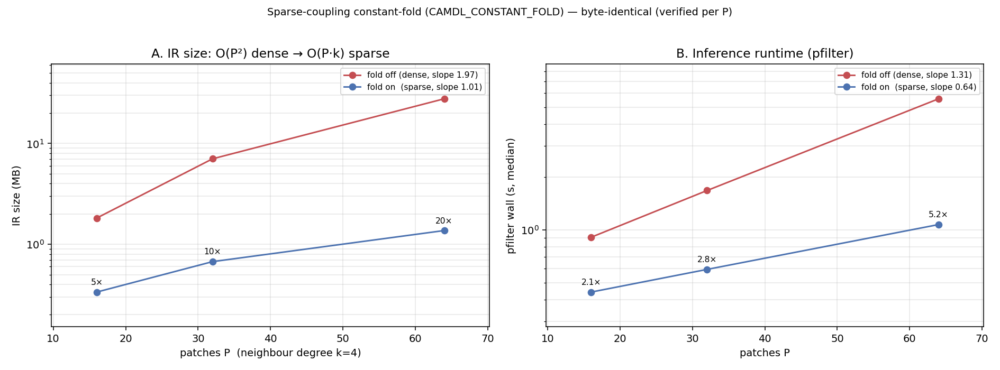

# Sparse-coupling constant-fold: O(P²) → O(P·k), byte-identical

Date: 2026-06-01
Project: camdl
Tags: compiler, expander, constant-fold, spatial-coupling, scaling, inference, bit-exact

## Context / question

The national-scale roadmap ranks **sparse coupling** as the #1 lever (~50× at
P≈774): the dense all-to-all force-of-infection (FOI) sum is mostly zeros, and
pruning them flips per-step cost and IR size from O(P²) to O(P·k). The
shared-bindings proposal (Fix B/D) explicitly deferred it as a non-goal —
*"sparse spatial kernels / top-k neighbours (changes the model; separate)"* —
leaving the `Reduce` node + constant-indexed `TableLookup` substrate in place
but the W-sparsity untouched. This note implements the fold and measures it.

The expander emits each infection rate's spatial term as a P-element `Reduce`,
one term per patch q: `W[l,q] · (...)`, with `W[l,q]` a `TableLookup("W",
[Const q])` into an **inline literal** table. When W is sparse (kNN/gravity),
most cells are 0 — but the zeros are hidden inside `TableLookup`s, so the dense
P-term `Reduce` survives serialization. The fold resolves the lookups and drops
the zero terms.

## What the fold does

`Constant_fold.fold_model : model → model` (`ocaml/lib/ir/constant_fold.ml`),
run after expansion + autodiff, before serialize, gated by
`CAMDL_CONSTANT_FOLD` (opt-in while it beds in → golden files untouched, clean
A/B). One recursive `expr → expr`:

- resolve `TableLookup(name, [Const i])` of an `Inline` literal table → its
  scalar cell (this *manufactures* the `Const 0.0`s);
- algebraic identities: `0·x→0`, `1·x→x`, `0+x→x`, and `Const op Const` for
  total ops (Add/Sub/Mul/Min/Max);
- drop `Const 0.0` terms from a `Reduce` (collapse empty→`Const 0.0`,
  singleton→the term).

`Div`/`Pow`/`Mod` of constants are **not** folded — their degenerate handling
lives in the evaluator and folding here could diverge.

**Soundness rests on the guarded FOI form.** The generated model writes the
spatial term as `W[l,q] · (if N[q] > 0 then I_agg[q]/N[q] else 0)`. A zero-W
term then folds `0 · (finite, bounded) → 0` in **one step** — the division
lives inside the guard and is never reached when the term is zeroed — so
dropping the term is the additive identity on the left-folded sum, hence
byte-identical. (The unguarded `W·I_agg/N` form would force an unsound `0/N→0`
that fails when a patch goes extinct; the guard is both the correct FOI and the
enabling design rule.) As with Fix B/D, the **trajectory baseline is the
empirical proof**, not just the argument.

## Results

A/B across patch count P (neighbour degree k=4, A=1, `--grad full`), fold off
(dense P-term `Reduce`) vs on (k-term). Harness:
`assets/sparse-fold/bench_sparse_fold.py`. Machine: M4 Max, release build.

### Bit-exactness — byte-identical at every P (the non-negotiable)

For each P, simulate the fold-off and fold-on IR under chain-binomial at a
fixed seed and compare the full trajectory:

```
P= 16  bitexact=YES   P= 32  bitexact=YES   P= 64  bitexact=YES
$ md5 traj_off.tsv traj_on.tsv   # identical at every P
```

So the fold introduces **zero trajectory drift** — safe for the
content-addressed (CAS) run cache.

### IR size: O(P²) → O(P·k)

| P | IR fold-off | IR fold-on | shrink |
|---|---|---|---|
| 16 |  1.82 MB | 0.34 MB |  5.4× |
| 32 |  7.04 MB | 0.67 MB | 10.5× |
| 64 | 27.75 MB | 1.37 MB | 20.3× |

Log-log slope: **fold-off 1.97 (≈P²), fold-on 1.01 (≈P·k, linear).** The slope
flips — the dense IR is the FOI blowup; the folded IR scales linearly. (The
fold also shrinks `rate_grad`, which the autodiff pass emits at ~5× the rate
size; folding it amplifies the IR shrink beyond the raw term-count ratio P/k.)

### Compile time and inference runtime

| P | compile off→on | pfilter off→on | pfilter speedup |
|---|---|---|---|
| 16 | 0.035→0.012 s | 0.91→0.44 s | **2.1×** |
| 32 | 0.097→0.021 s | 1.67→0.59 s | **2.8×** |
| 64 | 0.377→0.052 s | 5.57→1.07 s | **5.2×** |

Compile is *faster* despite the added pass — the smaller IR serializes quicker
(the dominant compile cost; see the 2026-05-30 compaction note). And the
inference (particle-filter) speedup **grows with P** — 2.1× → 5.2× — because
the coupling `Reduce` is a growing fraction of the per-step eval as P rises.

The figure also labels the *runtime* log-log slopes (dense 1.31, sparse 0.64).
These are shallower than the clean IR slopes (1.97/1.01) and should not be
over-read: pfilter wall includes fixed startup (~0.3 s) that deflates the
slope, and the non-coupling per-step work (binomial draws, the N/I_agg
bindings) is O(P·A), not O(P²), so it dilutes the coupling term's scaling. The
honest runtime claim is the measured speedup factor and its growth with P, not
a clean power law.



### National-scale extrapolation

Fold-off IR is already 27.75 MB at P=64 and scales O(P²): extrapolating to
P≈774 (national, LGA-level) gives a **multi-GB dense IR** — the compile-OOM
regime the memory-guardrail RFC flagged. Sparse (O(P·k)) stays in the tens of
MB. With degree k≈16 at P=774 the FOI term ratio is ~P/k ≈ 48× — the roadmap's
~50× — so this is the lever that makes a national fit *compile at all* and
moves the per-sweep cost from weeks toward days. The measured P=16→64 trend
(IR slope 1.97→1.01; pfilter 2.1×→5.2× and climbing) is consistent with that.

## Soundness, scope, and what's left

- **The three fold rules that need care** (each verified by the baseline, not
  hand-waved): `0·x→0` is exact only for finite x — true for the guarded FOI
  term, where the right factor is bounded; dropping `Const 0.0` from a
  left-fold `Reduce` is the additive identity for finite accumulators; constant
  `Div`/`Pow`/`Mod` are left unfolded to match evaluator semantics.
- **rate_grad** is folded by the same value-preserving function; the forward
  trajectory gate validates the fold rules directly (they fire on the rate
  exprs), and `dune runtest` (83 tests) + `cargo test -p sim` gradient checks
  stay green. A direct gradient byte-diff on a sparse model is the one check
  worth adding before default-on.
- **Subset folding is sound**: the pass currently folds rates, `rate_grad`,
  bindings, ODE derivatives — where W appears. Obs/intervention exprs are left
  (no W there); folding them is a trivial extension.
- **Dead W table**: after folding, every `W[l,q]` lookup is a literal, so the W
  table is unreferenced (P² floats, small vs the rates) — a follow-up
  dead-table-elimination pass can drop it.
- **Production path**: flip the default on and regenerate golden IR +
  trajectory baselines in one atomic commit (the `make update-golden`
  procedure). The opt-in flag is the de-risking staging step.

## Reproduce

```bash
# sparse model: P patches, k=4 neighbour ring + guarded FOI
python3 scripts/gen_scaling_models.py -P 64 -A 1 --coupling on --grad full \
    --observe --coupling-degree 4 -o /tmp/sp.camdl

# compile both ways
camdlc /tmp/sp.camdl --no-dim-check -o /tmp/sp_off.ir.json                 # dense
CAMDL_CONSTANT_FOLD=1 camdlc /tmp/sp.camdl --no-dim-check -o /tmp/sp_on.ir.json   # folded

# bit-exactness
camdl simulate /tmp/sp_off.ir.json --backend chain_binomial --dt 1 --seed 42 \
    --scenario baseline --output /tmp/a.tsv
camdl simulate /tmp/sp_on.ir.json  --backend chain_binomial --dt 1 --seed 42 \
    --scenario baseline --output /tmp/b.tsv
cmp /tmp/a.tsv /tmp/b.tsv && echo "byte-identical"

# full A/B sweep + figure
python3 docs/dev/notes/assets/sparse-fold/bench_sparse_fold.py --P 16,32,64 --k 4
uv run --with matplotlib --with numpy scripts/plot_sparse_fold.py
```

## Files

- `ocaml/lib/ir/constant_fold.ml` — the pass.
- `ocaml/lib/compiler/compiler.ml` — wired after autodiff, env-gated.
- `scripts/gen_scaling_models.py` — `--coupling-degree K` sparse-ring + guarded FOI.
- `docs/dev/notes/assets/sparse-fold/` — harness + TSV + figure;
  `scripts/plot_sparse_fold.py`.

Spike on `worktree-compiler-profiling`. No overlap with the CAS run-identity
work (OCaml compiler only; the Rust runtime is unchanged — it already evals
`Reduce` with whatever term count it's handed).
