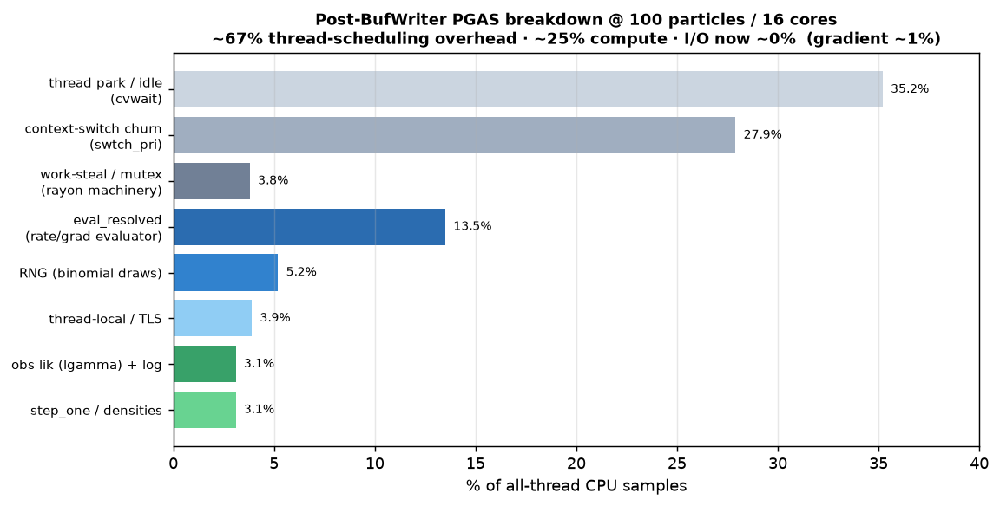
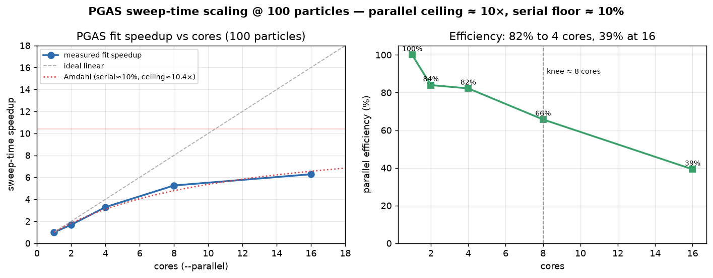

# PGAS fit was I/O-bound, not compute-bound: unbuffered trajectory dump

Date: 2026-06-14\
Project: camdl\
Tags: profiling, pgas, inference, io, samply

Implemented: 3d905488 (`perf(fit): buffer PGAS trajectory-sample writes`)

## Context / question

Continuing the PGAS performance work (sibling to
[`2026-06-13-pgas-parallelism-and-scaling.md`](2026-06-13-pgas-parallelism-and-scaling.md),
the gh#209 CSMC-parallelism study). Question: where does a PGAS fit actually
spend its wall time, and how much faster can it go?

## Finding (headline)

**60% of a PGAS fit's wall time was a single unbuffered file write, unrelated to
inference.** The per-sweep latent-trajectory dump in `cli/fit/pgas.rs`
(`run_stage`) wrote each field of a ~1455-substep × 723-column TSV with its own
`write!` to a raw `std::fs::File` — ~1.05M `write()` syscalls per file, ~10.5M
across a 10-sweep fit. Wrapping the file in a `BufWriter` collapses that to a
few hundred syscalls per file.

Measured (polio 12-patch metapop: 145 compartments, 577 transitions, 1455
substeps; 80 particles, 10 sweeps, `--parallel 16`, M4 Max):

|        | wall      | sweep-loop breakdown                                    |
| ------ | --------- | ------------------------------------------------------- |
| before | 40.1s     | csmc 37% · gradient 1% · **trajectory-I/O 60% = 24.5s** |
| after  | **15.6s** | csmc 94% · gradient 2% · trajectory-I/O **0.15s**       |

**2.57× on the whole fit.** Output bytes are identical (verified: 10 files, 723
cols × 1456 rows, complete to t=2910). I/O is gone; the fit is now bound by
inference work.

That table is the **degenerate** profiling bench (0% acceptance — NUTS diverges
at an infeasible start and barely runs, so "csmc 94%" overstates csmc and the
gradient looks like 1%). The representative picture comes from a **healthy**
fit.

This I/O cost scales _up_ with model size: it is
`substeps × (compartments + transitions) × sweeps`. A 244-ward national model
(gh#207/#209) would be ~60M syscalls per trajectory file unbuffered, so the fix
matters most at the scale we care about.

## Post-fix breakdown of a healthy fit (where the gradient actually runs)

samply of a _healthy_ fit (single-param recovery, 23% acceptance, real NUTS
trees; 100 particles, 16 cores, 30 sweeps) — all-thread CPU self-time, leaf
attribution via the `.syms.json` sidecar
([`assets/2026-06-14-pgas-io/healthy-fit-leaf-selftime.tsv`](assets/2026-06-14-pgas-io/healthy-fit-leaf-selftime.tsv)):



| bucket                                       | % all-thread CPU |
| -------------------------------------------- | ---------------- |
| thread park / idle (`__psynch_cvwait`)       | 35%              |
| context-switch churn (`swtch_pri`)           | 28%              |
| rayon work-steal / mutex                     | ~4%              |
| **`eval_resolved`** (rate/grad evaluator)    | **13.5%**        |
| RNG (`binomial` draws)                       | ~5%              |
| obs-lik (`lgamma`) + `log` + densities + TLS | ~13%             |
| trajectory I/O                               | **~0%**          |
| gradient                                     | **~1%**          |

Two facts that overturn the "gradient is the bottleneck" intuition:

1. **The gradient is ~1% even in a healthy fit.** It rises in absolute calls
   (real NUTS trees), but csmc propagates ~100 particles per sweep while the
   gradient runs over a single trajectory — csmc compute dominates by ~100×. The
   gradient is not a lever at any acceptance rate at this model size.
2. **At small scale the fit is scheduler-bound, not compute-bound.** ~67% of
   all-thread CPU is parking / context-switch / steal overhead; only ~25% is
   real compute (and that is `eval_resolved`-dominated, matching the gh#209
   national-scale finding). 100 particles / 16 cores ≈ 6 particles/thread — the
   per-substep per-particle work is too small to amortize rayon fork/join across
   the 1455 sequential substeps.

## Sweep-time scaling: parallel ceiling ≈ 10× (100 particles)

Thread-scaling of the full fit (100 particles, 12 sweeps, fixed seed;
`--parallel` is honored and numerics are bit-identical;
[`assets/2026-06-14-pgas-io/fit-sweep-scaling.tsv`](assets/2026-06-14-pgas-io/fit-sweep-scaling.tsv)):



| cores | wall (s) | speedup | efficiency |
| ----- | -------- | ------- | ---------- |
| 1     | 311.3    | 1.00×   | 100%       |
| 2     | 185.4    | 1.68×   | 84%        |
| 4     | 94.7     | 3.29×   | 82%        |
| 8     | 59.2     | 5.26×   | 66%        |
| 16    | 49.6     | 6.28×   | 39%        |

Near-linear to ~4 cores, knee at ~8; **16 cores buys only 1.19× over 8** for 2×
the cores. An Amdahl fit gives a **serial fraction ≈ 10% → ceiling ≈ 10×** no
matter how many cores — the serial floor is the per-substep resampling barrier +
the (serial) NUTS gradient + bookkeeping, not the parallel particle propagation.

Implications for driving sweep time down:

- The parallelism already works; **8 cores is the sweet spot** at this particle
  count (5.3×, 66% eff) — 16 cores wastes 60% of the fleet (matches the samply
  ~67% overhead).
- **Coarser-grained csmc task chunking** (particles per rayon task, not one task
  per particle) would attack the high-core inefficiency — recover part of the
  gap between the measured 6.3× and the ~10× Amdahl ceiling at 16 cores. Best
  case ~8×, i.e., ~49.6 s → ~38 s (a further ~1.3×). Bounded by the 10% serial
  floor; not transformative at this scale.
- **Particle count is the real scaling knob.** At 100 particles, 16 cores is
  starved (6 particles/core). At national scale (thousands of particles), the
  parallel work fills the cores and scaling extends toward the gh#209 ~120×
  regime _without_ chunking — so chunking matters most at small/medium particle
  counts, and the serial floor (resampling barrier) becomes the cap at scale.

Caveat / gap (verified): **standalone `camdl pfilter` silently ignores
`--parallel`.** At 500 particles it uses ~14 cores at _both_ `--parallel 1`
(cores_eff = 14.1) and `--parallel 16` (14.2) — so it parallelizes fine but
cannot be throttled, and a thread-scaling sweep via `--parallel` is flat (every
run uses all cores). Cause: the global rayon pool is already built before the
pfilter CLI's `build_global` call (`pfilter.rs:~430`, whose `let _ = …` swallows
the `AlreadyInitialized` error). The fit path respects `--parallel` correctly
(table above), so this was pfilter-CLI-specific. **Fixed in f7bde701** — a
scoped local rayon pool (`ThreadPoolBuilder::build()` + `pool.install(...)`,
order-independent) in pfilter/profile/survey; verified `--parallel 1` →
cores_eff ≈ 0.6 (was ~14), loglik byte-identical. `batch.rs` has the same
`build_global`-after-load anti-pattern at two sites — a clean same-shape
follow-up, left out to keep that commit scoped.

## Compute-lever A/B: both big levers are already on and both pay

pfilter, 500 particles, 3 seeds, result-cache cleared per run, interleaved per
seed (so background load hits each condition equally):

| condition                    | wall (median) | vs baseline      | loglik    |
| ---------------------------- | ------------- | ---------------- | --------- |
| baseline (fold on, cache on) | 6.27s         | —                | identical |
| `CAMDL_NO_CONSTANT_FOLD`     | 9.84s         | **1.57× slower** | identical |
| `CAMDL_NO_BINDING_CACHE`     | 7.14s         | **1.15× slower** | identical |

- **Sparse-coupling fold saves ~36%** (1.57× slower without) — already on by
  default, already load-bearing even at P=12 (the O(P²)→O(P·k) saving grows with
  patch count). Logliks bit-identical baseline-vs-unfolded across all 3 seeds —
  exercises the byte-identical fold gate that was previously untested.
- **Binding cache nets +13%** (1.15× slower without) — the memoization beats its
  thread-local access cost (the earlier worry that the ~10% TLS overhead made it
  net-negative is refuted). Identical loglik (pure memoization).

So the two biggest known compute levers are already capturing their value — no
free toggle win. The remaining serial headroom is the binding-cache thread-local
_access_ itself (~10% of serial compute; macOS `_tlv_get_addr` is slow): keep
the cache but thread it by `&mut` instead of a `thread_local!`, recovering most
of that ~10% while keeping the +13% benefit. Beyond that, `eval_resolved` (~43%
of serial compute, post-fold) is the interpreted `ResolvedExpr` tree-walk — a
flattened/bytecode evaluator is the documented ~2–8× lever (roadmap note
2026-05-29), deferred not rejected.

## Three plausible-but-wrong candidates ruled out first

The bottleneck was hidden behind a wrong assumption — that the NUTS **gradient**
dominated (inferred from `rest = total − csmc ≈ 65%`, never measured directly).
Acting on that assumption, three levers were built/tested and all failed,
because they targeted a 1% slice:

| candidate                 | result    | why it's not the lever                     |
| ------------------------- | --------- | ------------------------------------------ |
| gradient binding cache    | 1.01×     | gradient cost isn't repeated binding evals |
| parallel-substep gradient | 1.15×     | gradient is ~1% of the loop, not 65%       |
| mimalloc (vs libmalloc)   | no change | not allocator-bound or contention-bound    |

A counting global allocator showed the gradient was **13%** of allocations (not
allocation-bound). Direct timing then showed the gradient was **1% of the loop,
called 20 times in 10 sweeps** — NUTS diverges immediately at the bench's
(infeasible, burn-in=0) start and barely touches it. The thing assumed to be the
bottleneck was 1%.

## How the real bottleneck was found (method, reusable)

1. **Counting global allocator** (env-gated `#[global_allocator]`, counter as a
   `pub static` in `sim` so `pgas.rs` can snapshot it around csmc vs the rest):
   gradient 13% of allocs, csmc 87%. Killed the allocation-bound hypothesis.
   _Gotcha:_ read the env flag once in `main()` into a plain `AtomicBool` —
   never `env::var_os` inside `alloc()`, which itself allocates → re-enters the
   allocator → deadlock.
2. **Direct timing** of `complete_data_loglik_grad`: 1% of loop, 20 calls.
3. **samply** with leaf + caller attribution: 60% of the main thread in the
   `write` syscall, under `run_pgas` → a per-sweep `write!`-to-`File`.
4. Traced to `cli/fit/pgas.rs:577`; confirmed file shape (723 × 1456) and file
   count (10) → ~10.5M syscalls.

### samply on macOS (worth knowing)

- `/usr/bin/sample` (the built-in) attaching to a separately-launched process on
  Apple Silicon + SIP **cannot unwind the stack without `sudo`** — every sample
  collapses to `_dyld_start`. Useless output that looks like a hang. Use
  **samply** instead: it execs the target as its own child, so it has sampling
  rights without sudo.
- `samply record --save-only` stores **un**symbolicated frames (raw addresses).
  `atos` against the binary needs the right load base and still mis-resolves
  through inlining (produced an internally-impossible stack here). The reliable
  path: add `--unstable-presymbolicate`, which emits a `.syms.json` sidecar
  whose `symbol_table` rva ranges match the profile's `frameTable.address`
  **directly** (no load-address guessing).

## The fix

`cli/fit/pgas.rs`, in `run_stage`'s trajectory-sample block:

```rust
if let Ok(f) = std::fs::File::create(&path) {
    let mut f = std::io::BufWriter::new(f);   // <- was: let mut f = ... (raw File)
    ...                                       // ~1455 × 723 write! calls
}                                             // BufWriter flushes on drop
```

PMMH's sibling writer already used `BufWriter` (`pmmh.rs:805`); pgas was the
lone offender.

## Downstream: after the I/O fix, recovery is mixing-limited (open)

With a _properly configured_ single-parameter recovery (estimate only `R0_c`,
start 4.0, truth 6.0, all else fixed at truth, burn_in=25), the sampler is
healthy — **78% acceptance** (the 0% acceptance seen on the profiling bench was
a misconfigured bench: it estimated `rho_afp` outside its truth value and fixed
several params off-truth). But `R0_c` does **not** recover — it crawls 4.000 →
4.002 over 50 sweeps.

A PF marginal-likelihood profile (X integrated out, 300 particles, all else at
truth) shows `R0_c` is **sharply identifiable** — peak at the truth, start 4.0
sitting **92.7 nats** below:

```
R0_c   3.0      4.0      5.0      6.0      7.0      8.0
ll    -2049.8  -1411.0  -1329.3  -1318.3  -1324.0  -1332.7   (peak at 6.0 = truth)
```

So the freeze is **purely a NUTS step-scale problem**. The profile curvature
implies a true marginal posterior sd ≈ **0.24**, but NUTS adapted its dense mass
matrix to sd ≈ **0.00015** — ~1600× too tight. It scales steps to the
_conditional_ p(θ | X, y) (artificially narrow: a single trajectory sample X
pins θ through the −3.76M transition density) rather than the _marginal_ p(θ |
y). Steps ~1600× too small → glacial mixing. Candidate fixes (inference math,
undecided): adapt the mass matrix on marginal θ-variance / inflate it; more
`csmc_sweeps_per_nuts`; or simply far more sweeps.

Note: a healthy fit (78% acceptance) builds real NUTS trees and calls the
gradient _many_ times per sweep — so once mixing is fixed, the gradient stops
being a 1% slice and the parked gradient levers may become worth revisiting.

## Repro

```bash
# breakdown (CAMDL_DEBUG_THREADS prints csmc/gradient/recompute/other split)
cd tests/recovery/cases/polio_metapop
CAMDL_DEBUG_THREADS=1 camdl fit run pgas_bench.toml --parallel 16

# R0_c marginal-likelihood profile (identifiability)
for r in 3 4 5 6 7 8; do
  sed "s/^R0_c .*/R0_c = $r.0/" truth.toml > /tmp/p.toml
  camdl pfilter model.camdl --params /tmp/p.toml --data data/afp.tsv --particles 300 --seed 7
done
```

## Next

- Decide the mixing-fix lever (mass-matrix scale is where the evidence points).
- Then re-profile: confirm csmc dominates and the gradient share rises in a
  healthy fit; revisit the parked gradient levers if so.
- Serial-speed levers (measure each via A/B before refactoring): `eval_resolved`
  (sparse-coupling fold), the binomial RNG draws, the binding-cache thread-local
  access (~10% — may not net positive for forward eval; `CAMDL_NO_BINDING_CACHE`
  A/B).
- TODO (later): extend the `CAMDL_SERIAL` escape hatch to `bootstrap_filter`
  (the `camdl pfilter` path) so a genuinely single-threaded pfilter is possible
  for clean serial profiling — currently only the fit's `csmc_as` would get it.
